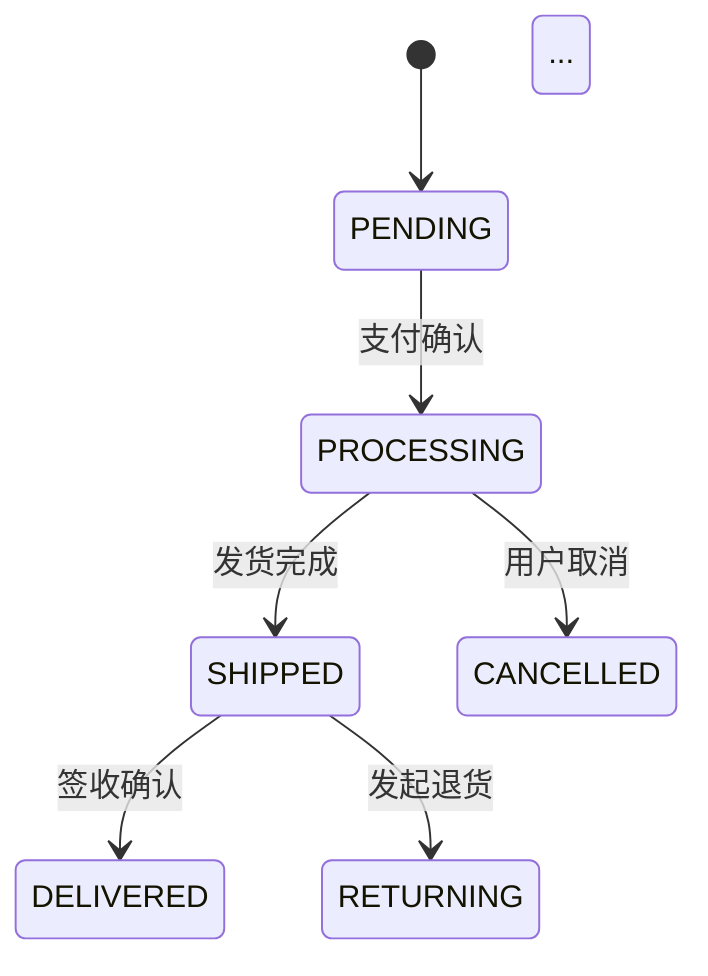
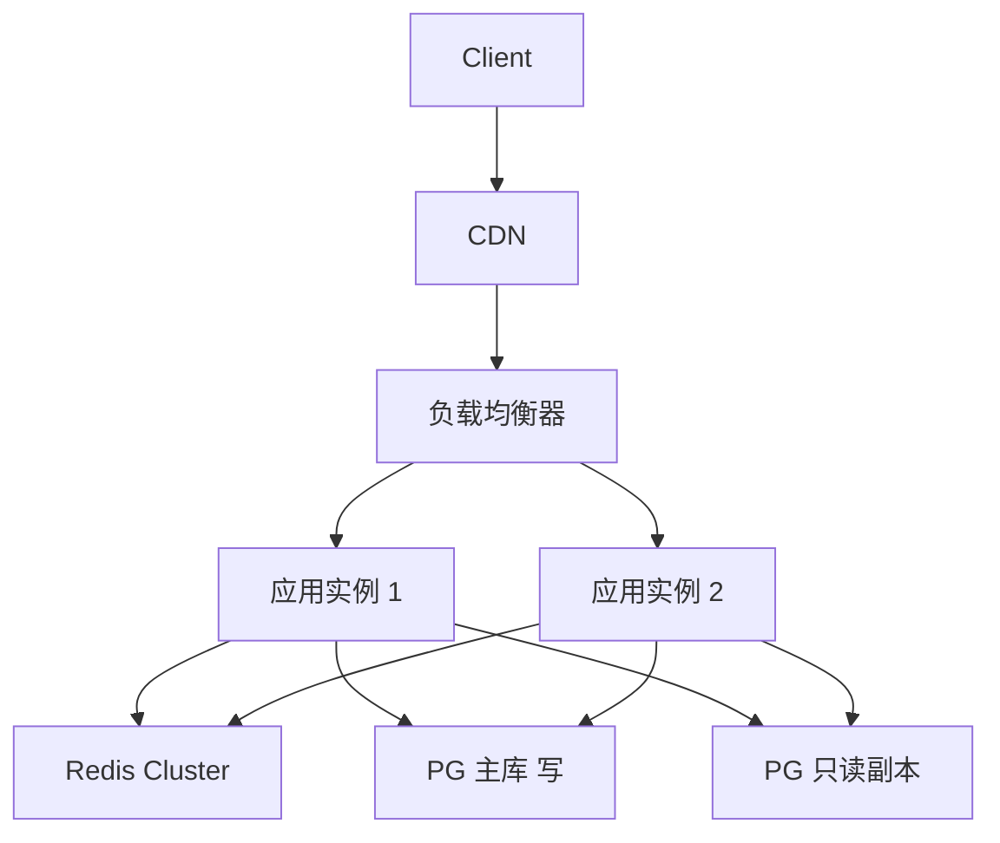
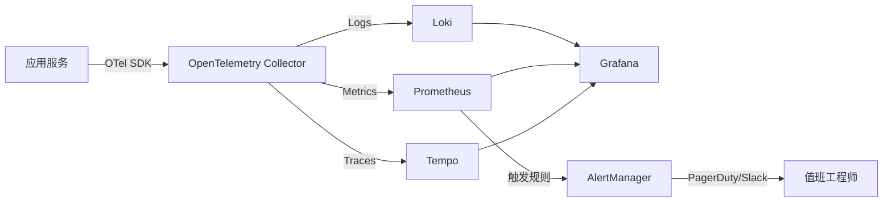

# OmniPM 全维度顶层设计模板

## 概述

本文件是 **Step A——顶层设计（系统化思考）** 的执行模板。Agent 在执行任何阶段开发前，必须逐项覆盖以下 7 大设计维度，逐一填写检查清单、输出设计决策并标注潜在风险。**任何维度不得跳过**；如某维度与当前项目不相关，必须输出"不适用声明"并给出理由。

---

## 维度总览

| 序号 | 维度名称 | 核心关注点 | 关键产出物 |
|------|----------|-----------|-----------|
| D1 | 数据架构 | 存储选型、数据模型、索引与迁移 | ER 图/表结构、迁移方案 |
| D2 | 记忆层/状态管理 | 缓存、会话、消息队列、前端状态 | 状态流转图、缓存策略 |
| D3 | 安全设计 | 认证授权、加密、防攻击、密钥 | 安全模型图、威胁清单 |
| D4 | 性能与可伸缩性 | 瓶颈预判、扩展策略、异步化 | 性能基线、扩展方案 |
| D5 | 可观测性 | 日志、监控、告警、链路追踪 | 可观测性架构图、告警规则 |
| D6 | 部署与运维 | 容器化、CI/CD、环境管理、灾备 | 部署拓扑图、CI/CD 流水线 |
| D7 | 合规与隐私 | 数据保护法规、隐私策略、审计 | 合规检查表、隐私声明 |

---

---

## D1. 数据架构

> 目标：确定数据存储方案，确保数据一致性、完整性和可演进性。

### D1.1 检查清单

请逐项检查并记录结论，确保每一项都有明确答案：

- [ ] **数据类型识别**：项目中涉及哪些类型的数据？（结构化数据、非结构化数据、时序数据、文件/二进制、图数据、向量数据等）
- [ ] **数据库选型**：
  - 关系型数据库（PostgreSQL / MySQL / SQLite / 其他）——选型依据是什么？
  - 是否需要 NoSQL（MongoDB / DynamoDB / Cassandra / Redis）——适用场景？
  - 是否需要搜索引擎（Elasticsearch / Meilisearch / Typesense）？
  - 是否需要向量数据库（Pinecone / Weaviate / Milvus / pgvector）？
  - 是否需要列式存储/数据仓库（ClickHouse / BigQuery / Snowflake）？
  - 是否需要图数据库（Neo4j / ArangoDB）？
- [ ] **数据模型设计**：
  - 核心实体识别（至少列出 5~10 个核心实体）
  - 实体关系梳理（1:1 / 1:N / M:N）
  - ER 图设计（可用 Mermaid 描述）
  - 表/集合命名规范
  - 字段类型、默认值、约束定义
  - 是否采用范式化/反正范式化？理由是什么？
- [ ] **索引策略**：
  - 主键策略（UUIDv4 / ULID / Snowflake / 自增ID）及选型理由
  - 高频查询字段的索引设计
  - 联合索引顺序与最左前缀原则
  - 是否需要全文索引？GIS 索引？
  - 是否需要覆盖索引优化特定查询？
- [ ] **数据迁移方案**：
  - 是否使用迁移工具（Flyway / Liquibase / Alembic / golang-migrate / Prisma Migrate）？
  - 迁移文件的命名规范和回滚策略
  - 种子数据（Seed Data）管理方案
  - 大表在线迁移策略（如 gh-ost / pt-online-schema-change）
  - 跨版本数据迁移的兼容性保障
- [ ] **数据备份与恢复**：
  - 备份频率和策略（全量/增量/差异）
  - RPO（恢复点目标）和 RTO（恢复时间目标）定义
  - 备份存储位置（同地域/异地/跨云）
  - 定期恢复演练计划
- [ ] **数据一致性**：
  - 是否需要分布式事务？采用什么方案（Saga / TCC / 2PC / 本地消息表）？
  - 读写分离下的一致性策略（强一致 / 最终一致）
  - 是否需要数据校验/对账机制？
- [ ] **数据生命周期管理**：
  - 数据归档策略（冷热分离）
  - 历史数据清理/保留策略
  - 是否涉及 GDPR/个人信息保护法的"被遗忘权"？

### D1.2 输出模板

执行 Step A 时，请按以下结构输出 D1 维度的设计报告：

```markdown
## D1. 数据架构

### 1. 数据全景图
- 结构化数据：[描述及选型]
- 非结构化数据：[描述及选型]
- 缓存数据：[描述及选型]
- 文件存储：[描述及选型]
- 搜索引擎/其他：[描述及选型]

### 2. 数据库选型决策

| 数据库 | 版本 | 用途 | 选型理由 |
|--------|------|------|----------|
| PostgreSQL 16 | LTS | 核心业务数据 | ACID 事务、丰富索引类型、成熟生态 |
| Redis 7.2 | LTS | 缓存 & 会话 & 限流 | 极低延迟、丰富数据结构 |
| ... | ... | ... | ... |

### 3. 核心实体与 ER 图

[在此列出核心实体及其关系，用 Mermaid 描述 ER 图]

```mermaid
erDiagram
    USER ||--o{ ORDER : places
    ORDER ||--|{ ORDER_ITEM : contains
    PRODUCT ||--o{ ORDER_ITEM : referenced_in
    ...
```

### 4. 索引策略

| 表名 | 索引名 | 索引字段 | 索引类型 | 理由 |
|------|--------|----------|----------|------|
| orders | idx_orders_user_id_created | (user_id, created_at DESC) | BTREE | 用户订单列表分页查询 |
| ... | ... | ... | ... | ... |

### 5. 数据迁移方案
- 迁移工具：[工具名]
- 迁移规范：[命名/目录结构/回滚策略]
- 种子数据：[初始化脚本说明]
- 大表变更策略：[方案]

### 6. 备份与恢复
- 备份策略：[频率/类型]
- RPO/RTO：[数值]
- 恢复演练：[计划]

### 7. 已知风险与缓解措施
| 风险 | 影响 | 概率 | 缓解措施 |
|------|------|------|----------|
| 数据量增长导致查询变慢 | 高 | 中 | 预建分片键、定期分析慢查询 |
| ... | ... | ... | ... |
```

### D1.3 常见问题

以下是数据架构设计中高频出现的问题及建议：

| 常见问题 | 现象 | 根因 | 正确做法 |
|----------|------|------|----------|
| 索引缺失或冗余 | 查询慢、写入慢、存储膨胀 | 未分析查询模式就建索引，或建了从不使用的索引 | 先在测试环境运行 EXPLAIN ANALYZE，基于实际查询模式建索引；定期审查未使用索引 |
| 主键选择不当 | 页分裂严重、分布式 ID 冲突、排序失效 | 使用自增 ID 做分布式主键，或 UUIDv4 做聚集索引 | 单机用自增；分布式用 ULID 或 Snowflake；聚集索引用有序 UUID（UUIDv7） |
| 未考虑数据量增长 | 上线 3 个月后查询超时 | 未做容量规划，未设计分库分表策略 | 在设计阶段评估 6 个月/1 年的数据量，预留分片键 |
| 范式化过度 | 一次查询需要 JOIN 8 张表 | 过度追求 3NF，忽视读取性能 | 查询密集型场景适当反正范式化，用冗余换性能 |
| 无迁移回滚方案 | 上线后发现数据问题无法快速恢复 | 只写了 UP 迁移未写 DOWN 迁移 | 每次迁移必须有对应的回滚脚本，且经过验证 |
| 忽略连接池配置 | 数据库连接耗尽、应用假死 | 连接池大小按默认值，未根据实际负载调优 | 计算公式：连接数 = (核心数 * 2) + 有效磁盘数；做压测验证 |
| 大事务长锁 | 业务高峰期锁等待、死锁频发 | 一个事务中处理过多数据 | 将大事务拆小，控制单次事务的行数上限 |

---

## D2. 记忆层/状态管理

> 目标：定义系统中所有"状态"的存储、流转与失效策略，确保数据在正确的时间出现在正确的位置。

### D2.1 检查清单

- [ ] **状态分类**：识别系统中所有"有记忆"的组件：
  - 用户会话状态（登录态、权限上下文）
  - 业务流程状态（订单状态、审批流状态、工作流状态）
  - 前端 UI 状态（表单数据、页面筛选条件、主题偏好）
  - 缓存数据（热点数据、计算结果缓存、API 响应缓存）
  - 消息队列中的待处理消息
  - 分布式锁/租约
  - Rate Limiter 计数器
  - 临时文件/上传暂存
  - WebSocket/SSE 连接状态
- [ ] **缓存策略**：
  - 缓存层级：本地缓存（应用内存）→ 分布式缓存（Redis）→ CDN 缓存 → 浏览器缓存
  - 缓存模式：Cache-Aside / Read-Through / Write-Through / Write-Behind——每种适用场景？
  - 缓存失效策略：TTL 设置、主动失效、LRU/LFU 淘汰
  - 缓存穿透/击穿/雪崩的防护措施（布隆过滤器、互斥锁、过期时间随机化）
  - 缓存一致性保障（最终一致 / Canal + MQ 方案 / CDC）
- [ ] **会话管理**：
  - 会话存储位置（内存 / Redis / 数据库 / JWT 无状态）
  - 会话过期策略（滑动过期 / 绝对过期）
  - 多设备登录策略（互斥踢出 / 允许共存 / 设备上限）
  - 跨服务会话同步方案（Session 集中存储 / Token 传递）
- [ ] **消息队列/事件驱动**：
  - 选型（RabbitMQ / Kafka / Redis Streams / NATS / AWS SQS）及理由
  - 消息可靠性保证（至少一次 / 最多一次 / 精确一次）
  - 死信队列（DLQ）和重试策略
  - 消息顺序性保障
  - 消息积压应对预案
- [ ] **前端状态管理**：
  - 状态管理库选型（Zustand / Redux / Pinia / Jotai / MobX）
  - 服务端状态 vs 客户端状态划分
  - 状态持久化策略（localStorage / IndexedDB / URL 参数）
  - 跨组件/跨页面状态共享方案
  - 表单状态管理（React Hook Form / Formik / 自定义方案）
- [ ] **状态机设计**（如果有复杂业务流程）：
  - 核心业务实体的状态枚举和状态转移图
  - 状态转移的前置条件、后置动作
  - 非法状态转移的防御机制
  - 状态变更的审计日志
- [ ] **分布式锁与并发控制**：
  - 是否需要分布式锁？选型（Redis Redlock / ZooKeeper / etcd / 数据库乐观锁）
  - 锁的超时/续期策略
  - 乐观锁与悲观锁的场景划分

### D2.2 输出模板

```markdown
## D2. 记忆层/状态管理

### 1. 状态全景图

| 状态类别 | 存储介质 | 生命周期 | 一致性与可靠性 | 容量预估 |
|----------|----------|----------|----------------|----------|
| 用户会话 | Redis (TTL 24h) | 登录→登出/过期 | 最终一致 | < 1MB/用户 |
| 订单状态 | PostgreSQL | 创建→完成/取消 | 强一致 | N/A |
| 热点数据缓存 | Redis + 本地Caffeine | 按 TTL | 最终一致 | < 100MB |
| ... | ... | ... | ... | ... |

### 2. 关键状态流转图

[对核心业务实体，绘制状态机图]



### 3. 缓存架构

- 缓存层级：[描述]
- 缓存模式选择：
  | 场景 | 模式 | 理由 |
  |------|------|------|
  | 商品详情 | Cache-Aside + Write-Through | 读多写少 |
  | ... | ... | ... |

- 缓存防护：
  - 穿透：布隆过滤器 / 空值缓存（TTL 5min）
  - 击穿：分布式互斥锁 + 热点数据永不过期
  - 雪崩：TTL + 随机偏移量（±30%）

### 4. 消息队列架构

| Topic/Queue | 生产者 | 消费者 | 消息可靠性 | 预期吞吐量 |
|-------------|--------|--------|------------|------------|
| order.created | 订单服务 | 通知服务、积分服务 | 至少一次 + DLQ | 1000/s 峰值 |
| ... | ... | ... | ... | ... |

- 消息格式规范：[JSON Schema / Protobuf / Avro]
- 重试策略：指数退避 + 最大重试 3 次 → DLQ
- 顺序保障：[单分区键 / Key 哈希]

### 5. 前端状态管理

- 方案选型：[库名及理由]
- 状态分层：
  - 服务端状态（React Query / SWR / RTK Query）：[哪些数据]
  - 客户端状态（Zustand）：[哪些数据]
  - URL 状态：[哪些参数]

### 6. 已知风险与缓解措施
| 风险 | 影响 | 概率 | 缓解措施 |
|------|------|------|----------|
| Redis 宕机导致会话丢失 | 高 | 低 | Redis Sentinel + 自动故障转移 |
| ... | ... | ... | ... |
```

### D2.3 常见问题

| 常见问题 | 现象 | 根因 | 正确做法 |
|----------|------|------|----------|
| 缓存与数据库不一致 | 用户看到旧数据、订单状态错乱 | 先删缓存再更新库，或先更新库再删缓存时序错乱 | 采用"先更新DB，再删除缓存" + 延迟双删；或使用 CDC 异步同步 |
| 缓存雪崩 | 缓存集中过期导致数据库瞬间压力过大 | 大量 Key 设置相同 TTL 同时过期 | 为 TTL 添加随机偏移量（±20%~50%）；核心数据采用逻辑过期（永不过期+异步刷新） |
| 会话存储于应用内存 | 重启后所有用户掉线 | 贪图方便未使用集中式会话存储 | 生产环境必须使用 Redis/数据库做集中式 Session Store；或采用无状态 JWT |
| 消息重复消费 | 同一消息被处理多次产生副作用 | 依赖"最多一次"语义但实际框架只保证"至少一次" | 消费者实现幂等：基于唯一键（msg_id）去重；数据库唯一约束兜底 |
| 前端状态与后端不一致 | 用户操作后界面未反映真实服务端状态 | UI 乐观更新未考虑失败回滚 | 使用服务端状态库（React Query/SWR），自动处理缓存失效；乐观更新必须实现 rollback |
| 未定义状态机的非法转移 | 出现 PENDING→DELIVERED 等非法跳转 | 代码中直接用字符串比较判断状态，未建模 | 使用状态机库（XState / 自定义枚举+转移表），编译期/运行时强制校验 |
| 分布式锁未设置续期 | 锁超时释放后业务仍继续执行 | 业务执行时间 > 锁 TTL，未做自动续期 | 使用 Redisson Watchdog 或基于租约的锁，锁到期自动续约或业务端检查锁有效性 |

---

## D3. 安全设计

> 目标：建立纵深防御体系，覆盖认证、授权、传输、存储、运行时全链路安全。

### D3.1 检查清单

- [ ] **认证机制（Authentication）**：
  - 认证方式：密码 / OAuth2.0 / OIDC / SAML / Passkey / WebAuthn / 短信/邮箱验证码？
  - 是否支持 MFA（多因素认证）？
  - JWT 设计：签发方、过期时间（Access Token ≤ 15min，Refresh Token ≤ 7d）、签名算法（RS256/ES256 优先于 HS256）
  - 会话劫持防护：Token 绑定（IP/UserAgent/设备指纹）、Token 撤销机制（黑名单/版本号）
  - 暴力破解防护：登录限流（账号级 + IP 级）、账户锁定策略、CAPTCHA
- [ ] **授权机制（Authorization）**：
  - 授权模型：RBAC / ABAC / ReBAC / PBAC？选型理由？
  - 权限粒度：页面级 / 功能级 / 数据行级 / 字段级
  - 权限缓存与实时性平衡
  - 默认拒绝原则（Deny by Default）是否落实？
  - 跨租户数据隔离方案（如 SaaS 多租户场景）
- [ ] **传输安全**：
  - 全链路 HTTPS / TLS 1.3
  - 证书管理（Let's Encrypt 自动续期 / 自签名策略）
  - 内部服务通信：mTLS 或 Service Mesh（Istio/Linkerd）
  - API 防重放攻击（Nonce + Timestamp）
  - WebSocket 安全（wss://、Origin 校验、Token 鉴权）
- [ ] **存储安全**：
  - 密码存储：bcrypt / argon2id（成本因子推荐值？）
  - 敏感数据加密：AES-256-GCM，密钥与数据分离存储
  - 数据库加密：TDE（透明数据加密）或应用层加密
  - 日志中敏感信息脱敏（手机号、身份证、银行卡、密码、Token）
  - 备份数据加密
- [ ] **Web 安全（OWASP Top 10）**：
  - [ ] 注入攻击（SQL/NoSQL/OS Command/LDAP）：参数化查询 / ORM 预编译
  - [ ] 失效的身份认证：Session 管理、Token 安全
  - [ ] 敏感数据泄露：加密、脱敏、最小暴露
  - [ ] XML 外部实体注入（XXE）：禁用 DTD 处理
  - [ ] 失效的访问控制：权限中间件、URL/方法级别校验
  - [ ] 安全配置错误：生产环境配置审查清单
  - [ ] 跨站脚本攻击（XSS）：CSP 头、输出编码、HttpOnly Cookie
  - [ ] 不安全的反序列化：类型白名单、签名校验
  - [ ] 使用已知漏洞组件：依赖扫描（Snyk / Dependabot / Trivy）
  - [ ] 不足的日志记录和监控：审计日志完整性
- [ ] **API 安全**：
  - API 认证（Bearer Token / API Key / HMAC 签名）
  - 输入校验（服务端校验为唯一权威，前端校验仅为用户体验）
  - 请求体大小限制
  - Rate Limiting（全局限流 + 每用户限流 + 每端点限流）
  - CORS 配置（严格白名单，禁止 `*`）
  - GraphQL 特有安全（深度限制、查询复杂度分析、Introspection 关闭）
- [ ] **密钥与配置管理**：
  - 密钥存储：HashiCorp Vault / AWS Secrets Manager / Azure Key Vault / 环境变量（仅开发环境）
  - 密钥轮换：是否支持自动轮换？轮换周期？
  - `.env` 文件已加入 `.gitignore`
  - 没有硬编码的密码、Token、API Key 在代码或配置文件中
  - CI/CD 中密钥注入机制
- [ ] **安全开发流程（SDL）**：
  - 代码审查安全 Checklist
  - 依赖漏洞自动扫描
  - SAST（静态应用安全测试）集成
  - 渗透测试计划
  - 安全应急响应流程

### D3.2 输出模板

```markdown
## D3. 安全设计

### 1. 认证架构

- 认证方案：[JWT + OAuth2.0 OIDC / Session + Cookie / ...]
- Token 设计：
  | 类型 | 过期时间 | 存储位置 | 刷新策略 |
  |------|----------|----------|----------|
  | Access Token | 15 min | 内存（前端）/ 不存储（后端校验签名） | Refresh Token 刷新 |
  | Refresh Token | 7 days | HttpOnly Secure Cookie | 近过期时自动续期 |
- MFA 策略：[描述]
- 防暴力破解：[限流规则]

### 2. 授权模型

- 模型类型：[RBAC / ABAC / 混合]，理由是 [理由]
- 角色定义：

| 角色 | 权限范围 | 数据可见性 |
|------|----------|------------|
| Admin | 全局管理 | 全部数据 |
| User | 个人数据 CRUD | 仅本人数据 |
| ... | ... | ... |

### 3. 威胁建模

| 威胁 | 攻击向量 | 影响等级 | 缓解措施 | 状态 |
|------|----------|----------|----------|------|
| SQL 注入 | 用户输入未过滤 | 严重 | 参数化查询 + WAF | 已防护 |
| XSS | 富文本未转义 | 高 | DOMPurify + CSP | 已防护 |
| CSRF | 跨站请求伪造 | 中 | SameSite Cookie + CSRF Token | 已防护 |
| 敏感数据泄露 | 日志明文输出 | 高 | 日志脱敏中间件 | 待实现 |
| ... | ... | ... | ... | ... |

### 4. 安全基础设施

- 证书管理：[描述]
- 密钥管理：[Vault / KMS 方案]
- WAF / DDoS 防护：[CDN / CloudFlare / AWS Shield]
- 依赖扫描：[Snyk / Dependabot / Trivy]

### 5. 安全审计

- 审计日志范围：[登录、权限变更、数据导出、敏感操作...]
- 日志格式：[结构]
- 日志保留：[周期 + 存储]

### 6. 已知风险与缓解措施

| 风险 | 影响 | 概率 | 缓解措施 |
|------|------|------|----------|
| 第三方依赖零日漏洞 | 严重 | 低 | 定期依赖升级 + 安全公告订阅 |
| ... | ... | ... | ... |
```

### D3.3 常见问题

| 常见问题 | 现象 | 根因 | 正确做法 |
|----------|------|------|----------|
| JWT Access Token 过期时间过长 | Token 泄露后有充足时间窗口被滥用 | 将 Access Token 当作"万能钥匙"设置了数小时甚至永久有效 | Access Token ≤ 15min，Refresh Token ≤ 7d；关键操作需重新认证 |
| 密码哈希使用快速算法 | 数据库泄露后密码被批量破解 | 使用 MD5/SHA-256 等为密码哈希设计的高速算法 | 必须使用 bcrypt（cost ≥ 10）、argon2id（推荐参数：m=65536, t=3, p=4） |
| 仅前端做输入校验 | 可通过 Postman/curl 绕过限制直接发送恶意数据 | 前后端分离后忽视了"客户端不可信"原则 | 前端校验仅提升 UX，服务端必须独立进行完整输入校验 |
| 日志中记录明文敏感数据 | 账号密码、身份证号、Token 被打包进日志 | 日志组件未配置脱敏规则 | 实现日志脱敏中间件/Serializer；建立敏感字段字典自动识别 |
| CORS 配置使用 `*` | 任意域名可跨域请求、CSRF 攻击 | 开发阶段图方便，直接放通所有域名 | 生产环境严格配置 Origin 白名单；不允许同时使用 `*` 和 `credentials: true` |
| 异常堆栈泄露内部路径 | 用户/攻击者看到完整文件路径和框架版本 | 生产环境未关闭 Debug 模式 | 生产环境：全局异常处理返回通用错误信息；详细错误仅记录日志 |
| GraphQL 无查询深度限制 | 攻击者发送深度嵌套查询导致服务端 OOM | 未意识到 GraphQL 可构造指数级复杂度的查询 | 设置查询深度上限（建议 ≤ 7）；计算查询复杂度分数；关闭 Introspection |
| 未对上传文件做安全检查 | 攻击者上传 webshell、XSS payload | 仅检查了文件扩展名或 MIME type | 检查文件魔术数字（magic bytes）；限制文件大小；存储于非执行目录；病毒扫描 |

---

## D4. 性能与可伸缩性

> 目标：识别性能瓶颈、定义性能基线，设计可水平扩展的架构。

### D4.1 检查清单

- [ ] **性能需求基线**：
  - 预期的 QPS（每秒查询数）和 TPS（每秒事务数）？
  - 关键 API 的 P50 / P95 / P99 延迟目标？
  - 并发用户数峰值预估？
  - 带宽/数据传输量预估？
  - 是否定义了 SLA/SLO/SLI？
- [ ] **瓶颈预判与压测计划**：
  - 识别系统的"最脆弱的单点"（通常是数据库）
  - 关键场景的压测用例设计
  - 压测工具选型（k6 / Locust / JMeter / wrk2 / Artillery）
  - 渐进式压测策略（基准测试 → 负载测试 → 压力测试 → 浸泡测试）
  - 全链路压测 or 单服务压测？
- [ ] **数据库性能**：
  - 慢查询监控与分析方案
  - 读写分离（主从复制 / 读写分离中间件）
  - 分库分表策略（垂直拆分/水平拆分，分片键选择）
  - 连接池调优（连接数、超时、验证查询）
  - 是否需要只读副本/读写分离？
- [ ] **缓存加速**：
  - 多级缓存策略（L1 本地缓存 / L2 分布式缓存）
  - 热点数据预加载/预热
  - 缓存命中率监控
  - 缓存预热/冷启动策略
- [ ] **异步化与解耦**：
  - 同步链路是否可改为异步？（发邮件、生成报表、图片处理...）
  - 消息队列削峰填谷策略
  - 定时任务/批处理（Cron / Scheduler / Job Queue）
  - 是否采用事件驱动架构（EDA）？
- [ ] **计算资源优化**：
  - 是否需要 CDN 加速静态资源/全球加速？
  - 计算密集型任务是否可预计算/离线计算？
  - 是否采用懒加载/分页/游标分页代替全量加载？
  - 数据库查询 N+1 问题排查
  - API 响应字段按需返回（GraphQL / 字段筛选 / Sparse Fieldsets）
- [ ] **水平扩展能力**：
  - 应用层：无状态设计，支持水平扩容（通过 K8s/负载均衡器）
  - 数据库层：读扩展（只读副本）、写扩展（分片/Citus/TiDB）
  - 缓存层：Redis Cluster / Codis / AWS ElastiCache
  - 消息队列：Kafka Partition / RabbitMQ Quorum Queue
  - 存储层：对象存储（S3/MinIO）天然水平扩展
- [ ] **高可用方案**：
  - 服务冗余（至少 2 副本，跨可用区部署）
  - 自动故障转移（数据库主从切换、K8s 自愈）
  - 熔断器（Circuit Breaker）——推荐库：resilience4j / Hystrix / Sentinel
  - 限流器（Rate Limiter）——算法：令牌桶 / 滑动窗口
  - 降级策略（优雅降级——核心链路 vs 非核心链路）
  - 隔离策略（线程池隔离 / 信号量隔离 / 舱壁模式）

### D4.2 输出模板

```markdown
## D4. 性能与可伸缩性

### 1. 性能基线定义

| 指标 | 目标值 | 测量方法 | SLO |
|------|--------|----------|-----|
| 首页加载时间 | P95 < 2s | Lighthouse / Web Vitals | 99% |
| 核心 API 延迟 | P99 < 200ms | APM 工具 | 99.5% |
| 并发用户数 | 峰值 10,000 | 压测 | N/A |
| 数据库 QPS | 读 5000/s 写 1000/s | 数据库监控 | 99.9% |

### 2. 瓶颈分析

| 组件 | 潜在瓶颈 | 风险等级 | 缓解方案 |
|------|----------|----------|----------|
| PostgreSQL | 单实例写入上限 | 高 | 读写分离 + 分片预留 |
| Redis | 单实例内存上限 | 中 | Cluster 模式 |
| 应用服务 | CPU/内存 | 低 | 水平伸缩 |
| ... | ... | ... | ... |

### 3. 扩展策略

- 应用层：[无状态设计 + K8s HPA（CPU > 70%）]
- 数据库层：[主从读写分离 → 分片（预留分片键）]
- 缓存层：[Redis Cluster 3 主 3 从]
- 存储层：[S3/MinIO 对象存储]



### 4. 异步化策略

| 同步操作 | 异步化方案 | 消息队列 | 消费者 |
|----------|-----------|----------|--------|
| 注册成功发邮件 | 事件驱动 | order.created → MQ | 通知服务 |
| 生成报表 | 任务队列 | report.generate → MQ | 报表 Worker |
| ... | ... | ... | ... |

### 5. 高可用与容错

- 熔断器配置：[错误率 > 50% 熔断，半开探测间隔 30s]
- 限流规则：[全局限流 10,000 req/s，单用户 100 req/s，单 IP 50 req/s]
- 降级策略：[非核心功能降级清单]
- 舱壁隔离：[线程池分组]

### 6. 已知风险与缓解措施
| 风险 | 影响 | 概率 | 缓解措施 |
|------|------|------|----------|
| 大促期间瞬时流量激增 10 倍 | 严重 | 中 | 弹性伸缩 + 提前扩容 + 限流 |
| ... | ... | ... | ... |
```

### D4.3 常见问题

| 常见问题 | 现象 | 根因 | 正确做法 |
|----------|------|------|----------|
| N+1 查询 | 列表接口随数据量增长线性变慢 | ORM 懒加载导致每条记录触发一次额外查询 | 使用 Eager Loading（`JOIN FETCH` / `includes` / `preload`）；监控 SQL 日志中的重复查询 |
| 数据库单点瓶颈 | 随着用户增长，数据库 CPU 持续 90%+ | 应用层已水平扩展但数据库仍是单点 | 读写分离为首要措施；然后考虑分片；使用缓存减少直读数据库 |
| 未设置超时 | 一个慢请求阻塞整个线程池，导致服务雪崩 | HTTP 调用、数据库查询、RPC 均未设置超时 | 所有外部调用必须设置超时：连接超时、读取超时、请求总超时；建议不超过 30s |
| 无分页或分页不当 | 接口一次性返回数万条数据，响应超时甚至 OOM | 未实现分页或使用 `LIMIT/OFFSET` 在大偏移量下性能恶化 | 使用游标分页（Cursor-based Pagination）代替偏移分页；API 强制默认分页 |
| 未区分核心/非核心链路 | 非核心服务故障导致核心业务不可用 | 所有服务强依赖，无降级策略 | 梳理核心链路，非核心依赖超时设短 + 降级返回默认值；引入熔断器 |
| 缓存滥用 | 不必要的数据进入缓存，内存持续增长 | 将所有"可能有用"的数据都丢进缓存 | 缓存黄金法则：只缓存热点数据（20% 数据承载 80% 请求）；设置合理 TTL 和最大内存 |
| 日志同步写盘 | 日志 I/O 成为性能瓶颈，拖慢业务逻辑 | 同步写日志，每次请求阻塞等待磁盘写入 | 使用异步日志框架；日志级别动态可调；生产环境日志级别不低于 INFO |
| 锁竞争 | 高并发下特定资源频繁被锁导致大量线程等待 | 锁粒度太粗或持有锁时间太长 | 缩小锁粒度；使用乐观锁代替悲观锁；考虑无锁数据结构；分离读写锁 |

---

## D5. 可观测性

> 目标：建立日志（Logs）、指标（Metrics）、链路追踪（Traces）三位一体的可观测性体系，确保线上问题可快速定位。

### D5.1 检查清单

- [ ] **日志（Logging）**：
  - 日志框架选型（控制台/文件/集中收集）
  - 结构化日志（JSON 格式，包含 trace_id、span_id、user_id、request_id 等关联字段）
  - 日志级别规范（DEBUG/INFO/WARN/ERROR/FATAL 各自定义）
  - 日志采样策略（全量 / 错误全量+正常采样）
  - 敏感信息脱敏（已在 D3 中确认）
  - 日志保留与轮转策略（保留天数、磁盘上限）
  - 日志聚合工具（ELK / Loki / Splunk / Datadog / 阿里云 SLS）
- [ ] **指标（Metrics）**：
  - 黄金指标（Golden Signals）：延迟、流量、错误率、饱和度
  - 业务指标：注册数、订单量、支付成功率、活跃用户数...
  - 应用指标：QPS、错误率、GC 频率、线程池使用率、连接池使用率...
  - 基础设施指标：CPU、内存、磁盘 I/O、网络流量...
  - 指标采集（Prometheus / OpenTelemetry / Datadog Agent）
  - 指标可视化（Grafana Dashboard）
  - USE 方法论（Utilization/Saturation/Errors）vs RED 方法论（Rate/Errors/Duration）
- [ ] **链路追踪（Tracing）**：
  - 追踪标准：OpenTelemetry / Jaeger / Zipkin / SkyWalking
  - 追踪范围：HTTP → Service → DB → Cache → MQ → 外部 API 全链路
  - 上下文传播（Trace Context / W3C 标准）确保跨服务传递 trace_id
  - 采样率策略（开发 100% / 生产 1%~10% 或尾部采样）
  - 慢请求自动标记和告警
- [ ] **告警（Alerting）**：
  - 告警规则定义（基于 SLO 燃烧速率/错误预算）
  - 告警分级：P0（需立即响应）、P1（1h 内）、P2（工作日处理）、P3（信息通知）
  - 告警通知渠道（钉钉/飞书/Slack/PagerDuty/企业微信/邮件）
  - 告警静默/抑制规则（维护窗口、关联告警合并）
  - 告警值班轮转与升级策略
  - **避免告警疲劳**：告警必须可行动（Actionable），减少噪音告警
- [ ] **健康检查**：
  - Liveness Probe（进程是否存活）
  - Readiness Probe（服务是否就绪接收流量）
  - Startup Probe（启动时间较长的服务）
  - 深度健康检查（依赖服务、数据库连接检测）
  - 各服务端点：`/health`、`/health/live`、`/health/ready`
- [ ] **错误追踪**：
  - 错误聚合去重（Sentry / 异常日志分组）
  - 错误上下文（用户 ID、请求参数、堆栈信息）
  - 错误趋势分析与告警

### D5.2 输出模板

```markdown
## D5. 可观测性

### 1. 可观测性架构总览



- 方案选型：[OpenTelemetry + Grafana LGTM Stack / ELK / Datadog / 阿里云 ARMS]
- 选型理由：[理由]

### 2. 日志规范

- 日志格式：
```json
{
  "timestamp": "2026-01-01T00:00:00.000Z",
  "level": "INFO",
  "service": "order-service",
  "trace_id": "abc123...",
  "span_id": "def456...",
  "user_id": "usr_xxx",
  "message": "订单创建成功",
  "context": { "order_id": "ord_xxx", "amount": 99.99 }
}
```

- 日志级别使用规范：
  | 级别 | 定义 | 示例 |
  |------|------|------|
  | FATAL | 服务无法启动/数据损坏 | 数据库连接失败 |
  | ERROR | 影响当前请求的错误 | 支付失败、第三方 API 超时 |
  | WARN  | 非预期但可恢复 | 缓存未命中触发 DB 降级查询 |
  | INFO  | 关键业务事件 | 用户注册、订单创建、状态变更 |
  | DEBUG | 调试信息（生产环境关闭） | 方法入参、中间变量 |

### 3. 核心监控指标

| 类别 | 指标名称 | 采集方式 | 告警阈值 |
|------|----------|----------|----------|
| RED | HTTP 请求速率 | OTel Metrics | - |
| RED | P95 延迟 | OTel Histogram | > 500ms 持续 5min |
| RED | 错误率 | OTel Metrics | > 1% 持续 5min |
| USE | CPU 使用率 | Node Exporter | > 80% |
| 业务 | 支付成功率 | 业务埋点 | < 95% |
| ... | ... | ... | ... |

### 4. 告警规则定义

| 告警名称 | 级别 | 触发条件 | 持续时长 | 通知渠道 | 处理手册 |
|----------|------|----------|----------|----------|----------|
| API 错误率过高 | P0 | error_rate > 5% | 3 min | 钉钉 + 电话 | [链接] |
| 数据库连接池耗尽 | P1 | db_connections > 90% | 5 min | 钉钉 | [链接] |
| 磁盘使用率 | P2 | disk_used > 85% | 10 min | 飞书 | [链接] |
| ... | ... | ... | ... | ... | ... |

### 5. 仪表板（Dashboard）规划

| 仪表板名称 | 目标用户 | 核心内容 |
|------------|----------|----------|
| 服务概览 | 全员 | RED 指标、QPS、健康状态 |
| 业务看板 | PM/运营 | 注册量、订单量、转化漏斗 |
| 基础设施 | DevOps | CPU/内存/网络/磁盘 |
| 数据库监控 | DBA/后端 | 慢查询、连接数、复制延迟 |

### 6. 已知风险与缓解措施

| 风险 | 影响 | 概率 | 缓解措施 |
|------|------|------|----------|
| 日志量过大导致存储成本失控 | 中 | 高 | 按级别采样、设置保留策略、定期清理 |
| 监控工具本身不可用 | 高 | 低 | 监控系统独立部署、跨可用区 |
| ... | ... | ... | ... |
```

### D5.3 常见问题

| 常见问题 | 现象 | 根因 | 正确做法 |
|----------|------|------|----------|
| 日志非结构化 | 查找问题需要 grep + 多次筛选，效率极低 | 日志使用纯文本自由格式、无统一字段 | 全部日志使用 JSON 格式输出；强制包含 trace_id、timestamp、level、message 四个核心字段 |
| 缺少分布式追踪 | 微服务调用链无法串联，跨服务问题定位靠猜 | 未集成追踪 SDK 或各服务使用不同追踪方案 | 统一使用 OpenTelemetry SDK；所有 HTTP/RPC/DB/MQ 调用自动注入 trace context |
| 告警噪音过多 | 值班人员对告警麻木，"狼来了"效应 | 阈值设置过低、未区分严重程度、未合并关联告警 | 告警必须可行动（被呼叫的人知道该干什么）；基于 SLO 燃烧速率设阈值；告警聚合窗口 |
| 仅监控基础设施忽略业务 | 服务器一切正常，但用户体验极差 | 缺少业务 KPIs 埋点和监控 | 定义核心业务指标（注册成功率、下单成功率、支付时延），建立业务级 Dashboard 和告警 |
| Dashboard 信息过载 | 打开 Grafana 看不出关键问题 | 将所有指标堆砌在一个面板，无层次无重点 | 遵循"5 秒原则"：5 秒内看到系统整体健康状况；分层设计（概览→详查→诊断），使用 USE 和 RED 方法论组织 |
| 无健康检查端点 | K8s 无法感知服务真实状态，滚动更新时流量打入未就绪 Pod | 未实现 Readiness Probe | 必须实现 `/health/live` 和 `/health/ready`；Readiness 需检测 DB/Redis/MQ 等关键依赖 |
| 日志丢失 | 崩溃前最后几秒的日志完全丢失 | 日志缓冲区未刷盘，或日志收集 Agent 为单点 | 使用异步但带确认的日志输出；部署高可用日志收集器；关键错误同步写盘 |

---

## D6. 部署与运维

> 目标：确保项目可一键部署、平滑升级、故障自愈，降低运维人力成本。

### D6.1 检查清单

- [ ] **容器化**：
  - Dockerfile 最佳实践（多阶段构建、非 root 用户、最小基础镜像）
  - `.dockerignore` 文件配置
  - 容器镜像仓库（Docker Hub / Harbor / AWS ECR / 阿里云 ACR）
  - 镜像标签策略（`latest` 禁止用于生产；SemVer + git SHA）
  - 容器启动顺序和依赖等待（init container / health check 依赖）
  - 是否使用 docker-compose 用于本地开发？
- [ ] **编排平台**：
  - Kubernetes（推荐） / Docker Swarm / Nomad / 无编排（单机 docker-compose）？
  - K8s 资源配置（requests/limits）
  - K8s 命名空间规划（dev / staging / prod）
  - HPA（水平自动伸缩）配置
  - Pod Disruption Budget（PDB）保证可用性
  - 节点亲和性/反亲和性（跨可用区部署）
- [ ] **CI/CD 流水线**：
  - CI 工具（GitHub Actions / GitLab CI / Jenkins / Argo Workflows / Drone CI）
  - CD 工具（ArgoCD / Flux / Spinnaker / 手动 kubectl）
  - 流水线阶段：Lint → Test → Build → Push Image → Deploy to Dev → Integration Test → Deploy to Staging → Smoke Test → Deploy to Prod
  - 代码合并前必须通过 CI
  - 生产发布：蓝绿部署 / 金丝雀发布 / 滚动更新？选择理由？
  - 回滚方案（快速回滚到上一版本的时间 < 5 分钟）
- [ ] **环境管理**：
  - 环境划分（local / dev / staging / prod）
  - 环境间差异管理（配置隔离、密钥隔离、数据隔离）
  - 配置管理方式（环境变量 / ConfigMap / 配置中心如 Apollo/Nacos/Consul）
  - Feature Flag / Toggle 机制
  - 环境销毁与重建策略
- [ ] **基础设施即代码（IaC）**：
  - 工具选择（Terraform / Pulumi / Crossplane / 云原生模板）
  - 基础设施代码的版本控制
  - 基础设施变更的审批流程
  - 状态文件管理与锁定（Terraform Backend）
- [ ] **灾备与容灾**：
  - 是否跨可用区（AZ）/跨区域（Region）部署？
  - 数据备份策略（已在 D1 中覆盖）
  - 灾难恢复计划（DR Plan）和恢复演练
  - RPO/RTO 目标
  - 是否考虑多活架构？
- [ ] **安全运维**：
  - SSH/堡垒机访问策略
  - 最小权限原则（IAM/Service Account 仅授予必须权限）
  - 容器安全扫描（Trivy / Clair / Snyk Container）
  - 网络策略（NetworkPolicy / Security Group 最小开放）
  - 运行时安全（Falco / 审计日志）

### D6.2 输出模板

```markdown
## D6. 部署与运维

### 1. 部署架构拓扑

```mermaid
graph TD
    subgraph "CDN / WAF"
        CDN[CloudFront / CloudFlare]
    end
    subgraph "K8s Cluster - Production"
        LB[Ingress / LoadBalancer]
        subgraph "app-namespace"
            App1[App Pod ×3]
            App2[Worker Pod ×2]
        end
        subgraph "data-namespace"
            PG[PostgreSQL (RDS)]
            Redis[Redis (ElastiCache)]
        end
    end
    CDN --> LB
    LB --> App1
    App1 --> PG
    App1 --> Redis
    App2 --> PG
    App2 --> Redis
```

- 平台选择：[K8s (EKS/GKE/AKS/自建) + RDS + ElastiCache]
- 选择理由：[理由]

### 2. 容器化方案

- Dockerfile 优化要点：
  - 多阶段构建（build stage + run stage）
  - 基础镜像：`alpine:3.20` / `distroless` / `chainguard`
  - `USER 1000` 非 root 运行
  - 健康检查：`HEALTHCHECK --interval=30s CMD curl -f http://localhost:8080/health || exit 1`
- 镜像仓库：[AWS ECR / Docker Hub]
- 标签策略：{git-tag}-{short-sha}，禁止 latest 进生产

### 3. CI/CD 流水线

| 阶段 | 工具 | 触发条件 | 操作 |
|------|------|----------|------|
| Lint | ESLint/golangci-lint | Pull Request | 代码规范检查 |
| 单元测试 | Jest/Go test | Pull Request | 覆盖率 > 80% |
| 构建镜像 | docker buildx | 合入 main 分支 | 多架构构建 |
| 部署 Dev | ArgoCD | 自动 | 监控同步 |
| 部署 Staging | ArgoCD | 手动审批 | 人工触发 |
| 部署 Prod | ArgoCD | 手动审批 | 金丝雀 10% → 监控 30min → 100% |

### 4. 环境矩阵

| 环境 | 用途 | 规模 | 数据 | 访问限制 |
|------|------|------|------|----------|
| local | 开发 | docker-compose 全部本地 | 模拟数据 | 无 |
| dev | 联调 | K8s 最小副本 | 脱敏测试数据 | VPN |
| staging | 预发布 | K8s 等同于 prod 但 1 副本 | 脱敏生产数据副本 | VPN |
| prod | 生产 | K8s 3 副本 + HPA | 真实数据 | 堡垒机 |

### 5. 配置管理

- 非敏感配置：K8s ConfigMap / 环境变量
- 敏感配置：K8s Secret (通过 External Secrets Operator 对接 AWS Secrets Manager / Vault)
- Feature Flags：[方案选型：LaunchDarkly / Unleash / 自研]

### 6. 灾备与恢复

| 场景 | RPO | RTO | 恢复流程 |
|------|-----|-----|----------|
| 单 AZ 故障 | 0 | < 5 min | 自动切换到备用 AZ |
| 数据库误删 | < 1 hour | < 30 min | 从最近备份恢复 + binlog 回放 |
| 全 Region 故障 | 0 | < 1 hour | DNS 切换备用 Region |

### 7. 已知风险与缓解措施

| 风险 | 影响 | 概率 | 缓解措施 |
|------|------|------|----------|
| K8s 集群版本升级引入兼容性问题 | 高 | 中 | 先在 staging 环境验证；K8s 版本偏差策略检查 |
| 镜像推送失败阻塞部署 | 中 | 低 | 镜像仓库高可用；多地域复制 |
| ... | ... | ... | ... |
```

### D6.3 常见问题

| 常见问题 | 现象 | 根因 | 正确做法 |
|----------|------|------|----------|
| Docker 镜像过大 | 拉取镜像慢、磁盘占用高 | 构建阶段未清理依赖；基础镜像使用 ubuntu/debian 完整版 | 多阶段构建；使用 Alpine/Distroless 基础镜像；`.dockerignore` 排除无关文件 |
| 配置硬编码在镜像中 | 每次配置修改都需要重新构建和部署 | 将配置与代码耦合在一起 | 配置与代码分离：环境变量 / ConfigMap / 配置中心；镜像应能在任何环境启动 |
| CICD 无回滚流程 | 生产出问题后只能"修复并等待下一次部署" | 团队认为"修一个 bug 很快"，未建立快速回滚机制 | 部署工具（ArgoCD/K8s）记录历史版本；一键回滚到上一版本；前置条件：保证数据库迁移向前兼容 |
| 开发/生产环境不一致 | "在我机器上能跑" | 开发用 Mac/Windows 本地运行，生产用 Linux 容器 | 统一使用容器化开发环境；docker-compose/devcontainer 模拟接近生产的环境 |
| 无资源限制 | 某个 Pod 内存泄漏拖垮整个节点 | K8s 未设置 requests/limits | 必须设置：requests={实际使用量}，limits={requests 的 1.5~3 倍}；配置 LimitRange 和 ResourceQuota |
| root 用户运行容器 | 容器逃逸后获得宿主机 root 权限 | Dockerfile 未指定 USER，默认 root | 必须在 Dockerfile 中指定非 root 用户运行（`USER 1000`）；K8s 配置 `securityContext.runAsNonRoot: true` |
| 证书过期导致全网故障 | HTTPS 证书到期，用户无法访问 | 未设置证书自动续期或未配置过期告警 | 使用 cert-manager + Let's Encrypt 自动管理证书；配置证书过期告警（提前 30 天） |
| 手动操作服务器 | 服务器配置偏离 IaC 定义，新人不知道改过什么 | 习惯 SSH 上去直接改，未回写代码 | 严格执行 IaC 纪律：所有基础设施变更必须通过代码。或使用不可变基础设施（Immutable Infrastructure） |

---

## D7. 合规与隐私

> 目标：确保项目符合适用的法律法规和行业标准，保护用户数据隐私。

### D7.1 检查清单

请根据项目覆盖的区域和行业，逐项确认：

- [ ] **适用法规识别**：
  - 是否涉及欧盟用户？→ GDPR（通用数据保护条例）
  - 是否涉及中国用户？→ 《个人信息保护法》(PIPL)、《数据安全法》、《网络安全法》
  - 是否涉及美国加州用户？→ CCPA/CPRA（加州消费者隐私法案）
  - 是否涉及医疗数据？→ HIPAA（美国）/《健康医疗数据安全指南》（中国）
  - 是否涉及支付数据？→ PCI-DSS（支付卡行业数据安全标准）
  - 是否涉及儿童数据？→ COPPA（美国）/《儿童个人信息网络保护规定》（中国）
  - 是否涉及金融数据？→ SOX（美国）/ 金融行业等级保护（中国）
  - 是否涉及 AI/算法？→ EU AI Act / 中国《生成式人工智能服务管理暂行办法》《互联网信息服务算法推荐管理规定》
  - 是否涉及跨境数据传输？→ 数据传输影响评估（TIA）/ 标准合同条款（SCC）/ 中国数据出境安全评估
- [ ] **数据分类分级**：
  - 数据资产盘点（收集了哪些数据？存储在哪里？谁有访问权限？）
  - 数据分类：公开 / 内部 / 机密 / 绝密
  - 个人信息分级：一般个人信息 / 敏感个人信息（生物识别、医疗健康、金融账户、行踪轨迹、不满14周岁儿童信息...）
  - 数据的"必需性"审查（最小必要原则）：每个字段是否必需？能否不收集？
- [ ] **用户权利保障**：
  - 用户知情权：是否有清晰的隐私政策/用户协议？
  - 用户同意：是否实现了明确的 Opt-in（主动同意）而非 Opt-out？同意是否可以撤回？
  - 用户访问权：是否提供数据导出功能？
  - 用户更正权：是否提供个人信息修改功能？
  - 用户删除权（被遗忘权）：是否提供账户注销和数据删除功能？
  - 用户数据可携带权：是否支持结构化数据导出？
  - 用户拒绝权：是否允许用户拒绝非必需的自动化决策/个性化推荐？
- [ ] **数据处理合规**：
  - 数据收集：是否明确告知目的、方式、范围？
  - 数据使用：是否超出用户同意的范围？
  - 数据存储：存储地点是否符合法规？境内数据是否本地化存储？
  - 数据共享：是否与第三方共享？是否有合同约束？
  - 数据跨境：是否有合规的跨境传输机制？
  - 数据处理记录（ROPA - 处理活动记录）是否维护？
- [ ] **技术合规措施**：
  - 数据加密（传输中 + 静态存储中）——已在 D3 中确认
  - 访问控制（最小权限 + 基于角色的访问）——已在 D3 中确认
  - 数据脱敏/匿名化 ——已在 D3 中确认
  - 审计日志完整性 ——已在 D5 中确认
  - 数据泄露通知机制（72 小时内通知监管机构——GDPR 要求）
  - 隐私设计（Privacy by Design）和默认隐私（Privacy by Default）
- [ ] **组织与流程合规**：
  - 是否指定了数据保护官（DPO）？
  - 是否定期进行隐私影响评估（PIA/DPIA）？
  - 是否定期进行合规审计？
  - 是否建立数据泄露应急响应流程？
  - 员工是否接受了数据保护培训？
  - 第三方供应商数据处理协议（DPA）
- [ ] **开源合规**（针对代码项目）：
  - 依赖库的 License 兼容性检查（Copyleft vs Permissive）
  - 是否有 License 文件？
  - 第三方代码/资源的使用是否合规（字体、图标、图片、模型权重）？
- [ ] **无障碍合规**：
  - Web 内容无障碍指南（WCAG）2.1 AA 级合规？
  - 是否需要符合 Section 508（美国）/ EN 301 549（欧盟）？

### D7.2 输出模板

```markdown
## D7. 合规与隐私

### 1. 适用法规清单

| 法规/标准 | 适用范围 | 合规要求摘要 | 当前状态 |
|-----------|----------|-------------|----------|
| GDPR | 欧盟用户 | 数据处理合法基础、数据主体权利、72h 泄露通知 | 待实施 |
| PIPL | 中国用户 | 告知同意、单独同意（敏感个人信息）、数据本地化 | 待实施 |
| ... | ... | ... | ... |

### 2. 数据分类分级

| 数据类别 | 敏感级别 | 存储位置 | 加密方案 | 保留期 | 访问权限 |
|----------|----------|----------|----------|--------|----------|
| 用户名/昵称 | 一般个人信息 | PostgreSQL | AES-256 存储加密 | 账户存续期 | 本人 + Admin |
| 手机号 | 一般个人信息 | PostgreSQL | AES-256 + 应用层脱敏展示 | 账户注销后 30 天 | 本人 + Admin |
| 密码哈希 | 机密 | PostgreSQL | bcrypt/argon2id | 账户存续期 | 仅系统内部 |
| 支付卡号 | PCI-DSS 范围 | 第三方托管（Stripe） | 不存储于我方系统 | N/A | 不适用 |
| ... | ... | ... | ... | ... | ... |

### 3. 用户权利实现矩阵

| 用户权利 | 实现方式 | 响应时效 | 状态 |
|----------|----------|----------|------|
| 知情权 | 隐私政策页面 + 注册时强制展示 | 注册前 | 待实现 |
| 同意撤回 | 设置→隐私→撤销同意 | 实时生效 | 待实现 |
| 数据导出 | 设置→数据→导出（JSON/CSV） | < 30 天 | 待实现 |
| 数据删除 | 设置→账户→注销 | < 30 天 | 待实现 |
| ... | ... | ... | ... |

### 4. 隐私设计措施

- 最小化收集：[列出仅收集的必要数据字段]
- 匿名化处理：[分析报告中使用的匿名化方案]
- 默认隐私设置：[用户初始状态的最严格隐私保护配置]
- Cookie Banner：[是否符合 ePrivacy 指令的要求]

### 5. 数据泄露应急预案

| 阶段 | 行动 | 责任人 | 时限 |
|------|------|--------|------|
| 发现泄露 | 安全团队启动应急响应 | CISO | 15 min |
| 遏制泄露 | 隔离受影响系统 | DevOps | 1 hour |
| 影响评估 | 确定泄露数据范围和受影响用户 | DPO | 24 hours |
| 监管通知 | 向监管机构报告（GDPR 72h） | DPO | 72 hours |
| 用户通知 | 通知受影响用户 | DPO/PR | 不无故延迟 |
| 事后复盘 | 根因分析 + 改进措施 | 全团队 | 2 weeks |

### 6. 开源与第三方合规

| 检查项 | 状态 | 备注 |
|--------|------|------|
| LICENSE 文件 | 已添加 | MIT License |
| 依赖 License 兼容性 | 已通过 | FOSSA/SPDX 扫描结果 |
| 第三方字体/图标 License | 已确认 | Material Icons (Apache 2.0) |

### 7. 已知风险与缓解措施

| 风险 | 影响 | 概率 | 缓解措施 |
|------|------|------|----------|
| 跨境数据传输不合规 | 严重 | 中 | 数据本地化存储 + SCC 签署 |
| 第三方依赖 License 污染 | 中 | 低 | CI 阶段自动 License 检查 |
| ... | ... | ... | ... |
```

### D7.3 常见问题

| 常见问题 | 现象 | 根因 | 正确做法 |
|----------|------|------|----------|
| 不知道适用哪些法规 | 项目上线后突然收到监管通知或用户投诉 | 开发团队缺乏法律合规意识，未在项目初期咨询法务 | 在设计阶段就识别目标市场和行业：中国就查 PIPL + 行业规定，服务欧盟用户就查 GDPR；不确定时咨询法务 |
| 隐私政策直接从模板复制 | 隐私政策描述与项目实际数据处理不匹配 | 直接复制一份长且"全面"的模板，但未对照实际数据处理活动 | 隐私政策必须准确描述：收集什么、为什么收集、存储多久、与谁共享；每次新增功能时同步更新隐私政策 |
| 过度收集用户数据 | 注册表单必填项十几项，用户流失 | "现在可能用不到，先存着以后用" | 最小必要原则：只要能不收集就不收集；注册阶段通常仅需邮箱或手机号 |
| 未区分"用户同意"类型 | 用户注册时一次性勾选所有同意项（捆绑同意） | 将所有数据处理目的捆绑在一个同意框中 | 必须分层同意：必要数据处理（可以无同意但需告知）VS 非必要（个性化推荐、营销推送、第三方共享）——需单独同意 |
| 账户注销 = 仅前端隐藏按钮 | 用户数据实际上从未被删除 | 注销流程只是将用户状态标记为 "deleted" 但仍然保留全部数据 | 必须实现真实的数据删除或不可逆匿名化；设定删除缓冲期（如 30 天），到期后彻底清除 |
| 不区分敏感个人信息 | 普通数据和生物特征、健康数据等同处理 | 未按照《个人信息保护法》对敏感个人信息（生物识别、医疗健康、金融账户、行踪轨迹等）做特殊保护 | 敏感个人信息：必须获得"单独同意"（不是捆绑在用户协议里）；必须进行个人信息保护影响评估（PIA）；更严格的加密和访问控制 |
| 忘记开源 License 合规 | 使用 GPL 库但项目闭源，面临法律风险 | 引入依赖时只看"是否好用"不看 License | 在 CI 中加入 License 扫描（FOSSA / LicenseFinder / 自定义脚本）；在依赖引入时评审 License 兼容性 |
| 前端 Cookie 未获取同意 | 直接设置功能性和追踪 Cookie，无提示 | 开发阶段使用分析工具直接在代码里引入 | 实现 Cookie Banner；区分必要 Cookie（可先设置）和非必要 Cookie（需用户同意后才设置） |
