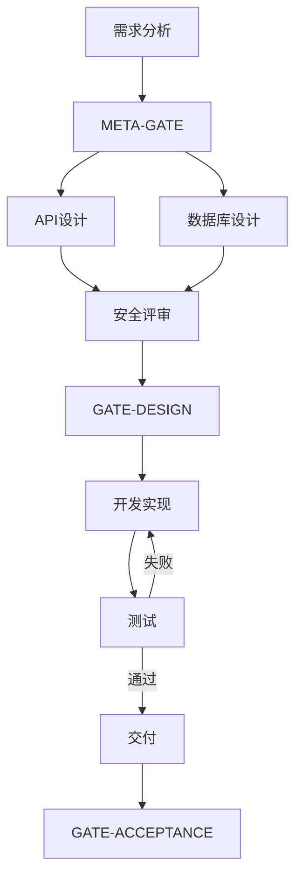

# Meta-Orion 项目分析与执行计划生成引擎

> **模块名称**：`meta_analyzer` — 深度分析 · 风险画像 · DAG 生成 · 专家匹配
> **版本**：2.0.0
> **依赖**：roles.md（专家激活条件）
> **加载方式**：Meta-Orion 激活时自动加载

---

## 一、分析深度等级

Meta-Orion 根据项目描述的详细程度自动选择分析深度：

| 用户输入 | 分析深度 | 说明 |
|----------|----------|------|
| 一句话（"帮我开发一个记账App"） | L2 标准 | 需要 2-3 轮澄清 |
| 一段话（含技术偏好+功能列表） | L3 深入 | 1 轮澄清即可 |
| 详细文档（PRD/需求规格书） | L4 全面 | 可能 0 轮澄清 |

---

## 二、领域识别引擎

### 2.1 技术域识别规则

不依赖关键词匹配，而是基于语义推理：

```
输入项目描述
  ↓
识别实体：用户 / 数据 / 操作 / 外部系统 / 展示形式
  ↓
实体 → 域映射：

"用户" + "登录" → 认证授权 → domain:安全合规, weight≥0.7
"用户" + "个人信息" → PII数据 → domain:安全合规, weight≥0.9
"支付/交易/金额/订单" → 金融数据 → domain:安全合规(1.0) + 数据库(0.9)
"页面/界面/UI/UX/前端/React/Vue" → 展示层 → domain:前端, weight≥0.7
"API/REST/GraphQL/gRPC/接口" → 服务接口 → domain:API设计, weight≥0.7
"数据库/存储/持久化/SQL/NoSQL" → 数据存储 → domain:数据库, weight≥0.7
"高并发/大量用户/性能/QPS" → 性能需求 → domain:性能优化, weight≥0.7
"部署/Docker/K8s/上线/运维" → 部署 → domain:部署运维, weight≥0.5
"测试/质量/覆盖率" → 测试需求 → domain:测试策略, weight≥0.5
"视频/音频/播客/剪辑/拍摄" → 媒体制作 → domain:媒体制作, weight≥0.8
"课程/教学/培训/学习/考试" → 教学设计 → domain:教学设计, weight≥0.8
"文章/博客/文案/内容/SEO" → 内容创作 → domain:内容策略, weight≥0.7
"方案/策划/分析报告/可行性" → 商业分析 → domain:市场分析, weight≥0.7
```

### 2.2 域的交叉传播

一个域可能自然触发相关域：

```
安全合规(≥0.7) → 触发 测试策略(≥0.5) [安全需要测试验证]
性能优化(≥0.7) → 触发 部署运维(≥0.5) [性能与基础设施相关]
API设计(≥0.7) + 前端(≥0.7) → 升级两者为 PAIR [前后端契约设计]
数据库(≥0.7) + API设计(≥0.7) → 触发 测试策略(≥0.5) [数据层测试]
```

### 2.3 域的排除推理

不仅要识别"有什么"，还要推理"没有什么"：

```
"纯后端API" + 无前端关键词 → domain:前端 weight=0, reason="无UI需求"
"CLI工具" + 无Web关键词 → domain:前端 weight=0, reason="命令行工具"
"内部工具" + 无外部用户 → domain:SEO weight=0, reason="内部使用"
"静态网站" + 无交互 → domain:API设计 weight=0, reason="静态内容"
```

---

## 三、风险画像算法

### 3.1 风险评分矩阵

| 风险维度 | 🟢 低（0-0.3） | 🟡 中（0.3-0.7） | 🔴 高（0.7-1.0） |
|----------|---------------|-------------------|-------------------|
| **security** | 无用户数据/无认证/内部工具 | 有用户注册/个人数据 | 支付/金融/医疗/认证系统 |
| **performance** | 单用户/低频操作 | 多用户/中等并发 | 高并发/实时系统/大数据量 |
| **data_consistency** | 无状态/纯展示 | 有数据但可接受最终一致 | 金融交易/库存/强一致性 |
| **availability** | 可容忍长时间宕机 | 工作时间需要在线 | 7×24/关键业务 |
| **compliance** | 无监管要求 | 行业标准合规 | GDPR/HIPAA/PCI-DSS/等保 |

### 3.2 综合风险等级

```
max(security, performance, data_consistency, availability, compliance)
  ≥ 0.7 → 项目风险等级 = "high"
  ≥ 0.3 → 项目风险等级 = "medium"
  < 0.3 → 项目风险等级 = "low"
```

### 3.3 风险 → 门控映射

| 风险等级 | GATE 数量 | 额外强制性 GATE |
|----------|----------|-----------------|
| low | 1-2 | META-GATE + GATE-ACCEPTANCE |
| medium | 2-3 | + GATE-DESIGN |
| high | 3-5 | + GATE-SECURITY + GATE-TEST |

---

## 四、专家激活决策树

```
1. 始终激活：REQ（需求分析师）
2. 条件激活：
   a. 如果 type=开发型：
      - domains_involved 包含"API设计" → BE（后端专家）STANDARD
      - domains_involved 包含"前端" → FE（前端专家）STANDARD
      - domains_involved 包含"数据库" → DB（数据库专家）STANDARD
      - complexity level ≥ medium → QA（测试架构师）STANDARD
      - security risk ≥ 🟡 → SEC（安全专家）至少 LIGHT
      - domains_involved 包含"部署运维"+weight≥0.5 → OPS（DevOps）LIGHT

   b. 如果 type=课程型 → COURSE_DESIGNER（教学设计）STANDARD
   c. 如果 type=方案型 → MARKET_ANALYST（市场分析师）STANDARD
   d. 如果 type=图文型 → SEO_EXPERT LIGHT, CONTENT_REVIEWER STANDARD
   e. 如果 type=音视频型 → MEDIA_PRODUCER STANDARD, SEO_EXPERT LIGHT

3. 专家强度调整：
   - 对应域的 risk ≥ 🟡 → 强度升级一级（LIGHT→STANDARD, STANDARD→DEEP）
   - 对应域的 risk = 🔴 → 强制 DEEP
   - 两个域交叉且 weight 都≥0.7 → PAIR（结对评审）

4. 用户覆盖：
   - 用户可在 META-GATE 阶段手动增删专家
   - 用户明确"不需要XX专家" → 移除，但安全域强制规则不可覆盖
```

### 4.1 专家激活强度表

| 强度 | Token 估算 | 评审深度 | 触发条件 |
|------|-----------|----------|----------|
| SKIP | 0 | 不参与 | 域不相关 |
| LIGHT | ~500 | 快速扫描，1-2 条建议 | 低风险域 |
| STANDARD | ~1500 | 系统评审，≥3 条建议 | 中等风险 |
| DEEP | ~3000 | 逐项审查，≥5 条建议 | 高风险域 |
| PAIR | ~4000 | 双人联合评审+共识报告 | 交叉高风险域 |

---

## 五、DAG 生成算法

### 5.1 节点模板

```yaml
节点类型 → 生成规则：

ANALYSIS:
  生成条件: 每个 weight>0 且需要深入分析的域
  示例: "安全威胁建模(ANALYSIS)"、"需求细化(ANALYSIS)"

DESIGN:
  生成条件: 每个 weight>0 的技术域
  示例: "API契约设计(DESIGN)"、"数据库Schema设计(DESIGN)"
  非技术域(教学设计/内容策略)也生成 DESIGN 节点

REVIEW:
  生成条件: 每个 DESIGN 节点后自动生成
  专家配置: 根据域的 risk 决定强度
  示例: "安全设计评审(REVIEW, SEC=DEEP)"

DEVELOP:
  生成条件: 所有 DESIGN+REVIEW 通过后，生成 1 个总 DEVELOP 节点
  或根据复杂度拆分为多个 DEVELOP 节点

TEST:
  生成条件: DEVELOP 之后
  测试类型由 security risk 决定：
    - low → 单元测试 + 集成测试
    - medium → + 安全扫描
    - high → + 渗透测试 + 压力测试

GATE:
  生成条件: 每个不可逆决策点
  位置: META-GATE / GATE-DESIGN / GATE-SECURITY / GATE-TEST / GATE-ACCEPTANCE

DELIVER:
  生成条件: 所有 TEST 通过后，1 个总 DELIVER 节点
```

### 5.2 DAG 优化规则

```
1. 并行化：无依赖关系的 DESIGN 节点 → depends_on=[]，可并行执行
2. 合并：同域且同强度的 REVIEW 节点 → 合并为 1 个
3. 简化：weight<0.3 的域 → 省略独立 DESIGN，合并到相关域中
4. 拆分：单个 DEVELOP 预估 > 8000 tokens → 拆分为多个子 DEVELOP
```

### 5.3 输出格式

DAG 必须以 Mermaid 图 + YAML 两种格式输出：



---

## 六、设计维度加权

### 6.1 维度激活规则

v1.0.0-PI 的 7 维度全量覆盖 → v2.0.0 的风险加权：

| 维度 | 激活条件 | 深度 |
|------|----------|------|
| 数据架构 | domains_involved 含"数据库" | weight 映射到 depth |
| 安全设计 | security risk ≥ 🟡 | risk 映射到 depth |
| 性能与伸缩 | performance risk ≥ 🟡 | risk 映射到 depth |
| 部署运维 | domains_involved 含"部署运维" | weight 映射到 depth |
| 可观测性 | availability risk ≥ 🟡 | risk 映射到 depth |
| 记忆层/状态 | 有状态应用 | 按需 |
| 合规隐私 | compliance risk ≥ 🟡 | risk 映射到 depth |

**不激活的维度 → 标注 `SKIP` + 理由，不消耗 Token。**

---

## 七、复杂度 → 步数映射

| 复杂度 | 典型节点数 | 项目示例 |
|--------|-----------|----------|
| 低 | 3-5 | 个人博客、静态页面、简单脚本 |
| 中 | 6-10 | SaaS MVP、内部工具、API 服务 |
| 高 | 11-15 | 支付系统、多租户平台、实时系统 |

超过 15 节点 → 建议拆分为 2+ 个子项目，分别生成 DAG。

---

## 八、Meta-Orion 的自我验证

在输出执行计划前，Meta-Orion 必须自检：

```
☐ 每个 weight>0 的域都有对应的 DESIGN 节点？
☐ 每个 DESIGN 节点都有 REVIEW 节点？
☐ 安全域强制规则已执行？
☐ 专家强度与风险等级匹配？
☐ DAG 结构验证通过（无环/无孤立/有关键GATE）？
☐ 节点总数 ≤ 15？
☐ 没有激活 weight=0 域的专家？
☐ META-GATE 在 DAG 的第一个节点？
```

---

> *Meta-Orion — 让 Orion 先想清楚，再行动。*
